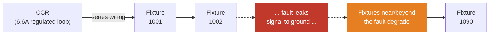
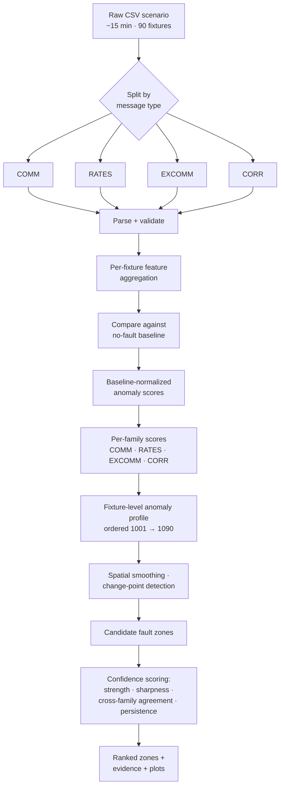

# EFD Localization

**Finding the fault on a runway lighting circuit — from telemetry alone, before an engineer ever leaves the truck.**

🏆 **Winning solution — ADB Safegate CORTEX Service Hackathon, Case Study 3: EFD Localization**

---

## The problem

Airfield lighting circuits are wired as one long **series loop**: a Constant Current Regulator (CCR) pushes ~6.6 A through every fixture on a runway or taxiway, one after another. That's great for uniform brightness — every fixture sees identical current — but terrible for diagnostics. When an earth fault appears somewhere on the loop, the system can tell you a fault exists. It cannot tell you **where**.

Today, "where" means a technician walking the circuit with handheld test gear, or isolating sections one at a time. On a long runway, that's slow, disruptive, and expensive — every extra minute is a minute the circuit stays offline.

**This project answers "where is the fault?" from the telemetry the circuit already produces — in software, the moment a fault is detected, with no new hardware.**

## The insight

The same two conductors that carry power to each fixture also carry **PLC (powerline communication)** — the data link between the CCR and every fixture. When a fault leaks current to ground, it leaks communication signal too. Fixtures near or beyond the fault see a weaker, noisier, more delay-prone channel than fixtures upstream of it.

Fixture IDs (`1001`–`1090`) are addressed in the same order the fixtures sit along the physical loop. That ordering is the whole trick: it turns 90 independent telemetry streams into one **spatial signal**. A fault doesn't just make one fixture noisy — it bends the shape of the *entire ordered chain* around the point of the leak. Find the bend, and you've found the zone.



## Why it's a hard problem (and why that shaped the design)

- **It's not classification, it's localization.** There's no single feature that says "fixture 47 is broken" — a series circuit shares one current path, so every fixture reflects the fault a little differently depending on distance.
- **The dataset is small.** Three lab test runs, four fault locations, a handful of resistance values. Training an opaque model on this would memorize the dataset, not learn the physics.
- **Faults range from obvious to nearly invisible.** A 0 Ω dead short screams through the telemetry. A 50 kΩ high-impedance fault barely disturbs the comm channel at all — the honest answer is sometimes "I can't tell."
- **An engineer dispatched on this needs evidence, not a black-box score.** A number they can't interrogate isn't a tool they can trust on a live runway.

So the design leans hard into **physics-guided, explainable spatial reasoning** instead of an end-to-end model — a ranked list of *suspect zones*, each backed by the telemetry that justifies it, each carrying an honest confidence level.

## How it works



**Four independent telemetry families, cross-checked against each other:**

| Family | What it measures | Physical layer |
|---|---|---|
| **COMM** | Response rate, attempts, failures, repeater hop depth, signal strength | Comm reliability |
| **RATES** | Success rate at each of 8 repeater "wave" depths, both directions | Channel shape, not just average |
| **EXCOMM** | Peak input level, bit errors, phase noise, CRC failures | Physical-layer signal quality |
| **CORR** | Correlated vs. uncorrelated signal peaks at the modem | Signal-to-noise behavior |

No single family is trusted alone. **Agreement across families is the core confidence mechanism** — if COMM, RATES, EXCOMM, and CORR all independently point to the same stretch of fixtures, that's real engineering evidence, not a statistical fluke.

For every scenario, the pipeline:

1. Builds a per-fixture, per-family feature table from 15 minutes of interleaved telemetry.
2. Normalizes every feature against that *specific fixture's* no-fault baseline (fixtures have their own quirks — a raw threshold would just relearn factory variation).
3. Turns normalized deviations into an anomaly score per fixture, per family.
4. Combines families into one anomaly profile across the ordered fixture chain, smooths it, and looks for change-points, slopes, and clustered degradation.
5. Ranks candidate zones and assigns each a confidence level — **High / Medium / Low / Uncertain** — instead of forcing a single overconfident answer.

Crucially, `faultLocation` and `faultResistance` — the ground-truth labels encoded in each filename — **never touch the prediction path**. They're joined back in only during evaluation, after predictions are already locked in.

## Results

- **Correctly zoned in on the fault region for 2 of the 3 fault locations tested**, from PLC telemetry alone — no CCR electrical readings, no impedance measurements, no physical position map, just the comm channel doing double duty as a spatial sensor.
- **Zero false alarms on no-fault baselines** — every clean recording (`faultLocation = 0`) came back correctly as no localized anomaly, rather than hallucinating a fault where there wasn't one.
- **Confidence tracks reality, not vibes.** Low-resistance faults produce sharper, more confident zones; high-impedance faults — which barely disturb the comm channel by physical necessity — honestly return lower confidence rather than fabricated precision. That's a feature of the design, not a shortfall: an engineer trusting a "High" call should be able to trust it every time.

The remaining gap is exactly what you'd expect from physics: **high-impedance faults (30–50 kΩ) leak so little signal that PLC telemetry alone is close to its information limit.** Closing that gap needs a different kind of data, not a bigger model — see below.

## What would make it better

The gap analysis this project is built to be honest about:

- **CCR electrical telemetry** — insulation resistance, phase angle, leakage current — would likely be the single biggest lift to precision. None of it is in this dataset.
- **A fine-grained physical position map.** Fixture *order* is preserved, but exact inter-fixture distances aren't, so predictions stay fixture-ID zones rather than metres.
- **More production data.** Three lab runs across four fault locations is enough to prototype a method, not enough to fully characterize edge cases.
- **Real-world variability.** This is clean lab data — no weather, no cable aging, no concurrent operational noise. Field deployment will need to prove out against that.

## Repository structure

```
.
├── README.md                          # you are here
├── notebooks/
│   ├── 01_data_loading_and_schema_validation.ipynb
│   ├── 02_baseline_eda.ipynb
│   └── Modeling.ipynb                 # feature engineering → scoring → evaluation
├── EFD_Localization_README.md         # original hackathon case-study brief
├── EFD_Student_Manual.docx            # hackathon reference manual
├── EFD_Localization_Presentation_Final.pptx   # final presentation deck
└── EFD_T0001-T0003_Data/              # raw lab telemetry (gitignored — not redistributed)
```

Design and implementation write-ups (`DESIGN_SPEC.md`, `TECH_SPEC.md`) are kept locally for reference and intentionally excluded from version control — this README is the up-to-date, standalone summary of the project.

## Design principles behind the pipeline

- **Preserve spatial structure.** Never collapse the 90-fixture chain to one circuit-level number — that's exactly the information that distinguishes one fault location from another.
- **Baseline-relative, always.** Every fixture is judged against its own no-fault history, not a global threshold.
- **Cross-validate across telemetry families.** No single stream is trusted in isolation.
- **Rank, don't force a single answer.** Second- and third-best zones are kept as real alternatives.
- **Say "I don't know" when the data doesn't support a confident answer.** Overclaiming precision is worse than an honest wide zone.

## Tech stack

Python · pandas · NumPy · matplotlib / seaborn — run as a sequence of Jupyter notebooks (Kaggle-compatible), deliberately kept simple, explainable, and parameter-light rather than reaching for opaque modeling on a small lab dataset.

---

*Built for ADB Safegate's CORTEX Service — turning telemetry the CCR already collects into a fault-triage capability, with no new hardware in the field.*
