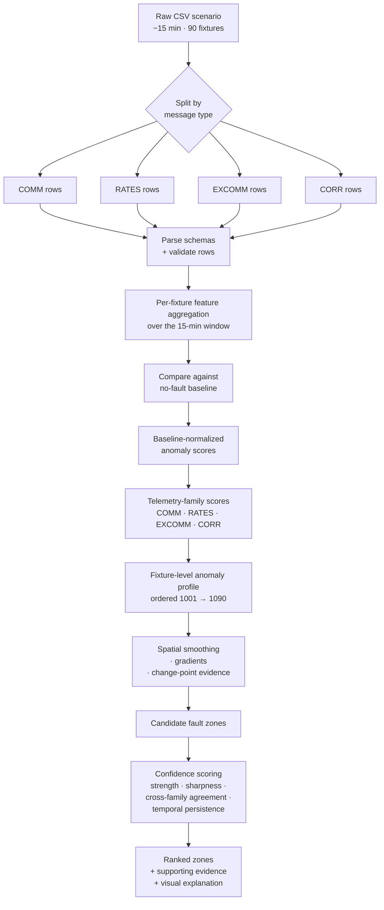

# EFD Localization — Technical Specification

> A concrete, implementation-oriented companion to `DESIGN_SPEC.md`. It describes **how** a small hackathon team should build the EFD localization solution in Jupyter notebooks — data layout, parsing rules, EDA, features, scoring, evaluation, and visualisation — without yet committing full code. The framing remains physics-guided spatial fault localization, not classification.

---

## 1. Technical Objective

The system performs **physics-guided spatial localization**, not classification. It accepts **one CSV scenario** (≈15 minutes of telemetry from a 90-fixture series circuit) and produces, for that scenario:

- A **ranked list of likely fault zones** along the ordered fixture axis (1001 → 1090), expressed as fixture-ID ranges. The top-ranked zone is the primary prediction; lower-ranked zones are retained as alternatives.
- A **confidence level per zone** (High / Medium / Low / Uncertain), driven by anomaly strength, spatial sharpness, temporal consistency, and cross-family agreement.
- **Supporting telemetry evidence** — the specific metrics and families that drove each zone score.
- A **visual explanation** — per-fixture plots of the anomaly profile and per-family contributions that let an engineer see and challenge the spatial signal the system reasoned from.

Hard rule, repeated throughout this spec: the filename fields `faultLocation` and `faultResistance` are **evaluation labels only**. They are never read by the prediction path and must never appear as features.

---

## 2. Data Structure and Inputs

### Folder layout
```
EFD_T0001-T0003_Data/
├── EFD_T0001/   # Run 1, ~24–33 CSVs
├── EFD_T0002/   # Run 2
└── EFD_T0003/   # Run 3
```

### Filename grammar
Every CSV filename follows:
```
<epoch>-<commCh>-<powerStep>-<faultLocation>-<faultResistance>.csv
```
For example: `1776351640-7-1-1-0.csv` → epoch `1776351640`, commCh `7`, powerStep `1`, faultLocation `1`, faultResistance `0` (hard short).

### Metadata extracted per file
A small metadata table is built up-front, one row per CSV, with the following fields:

| Field | Source | Notes |
|---|---|---|
| `file_name` | filename | Unique identifier per scenario. |
| `epoch` | filename, segment 1 | Unix seconds; start of recording. |
| `commCh` | filename, segment 2 | Always 7 in this dataset. |
| `powerStep` | filename, segment 3 | Always 1 in this dataset. |
| `faultLocation` | filename, segment 4 | **Label.** 0 = no fault; 1–4 = physical locations (codes only). |
| `faultResistance` | filename, segment 5 | **Label.** Code 0,1,2,3,4,5,8 (codes 6, 7 absent). |
| `run_id` | parent folder | `T0001` / `T0002` / `T0003`. |

### Resistance code → ohms lookup
| Code | Resistance | Description |
|---|---|---|
| 0 | 0 Ω | Hard short |
| 1 | 5 kΩ | Low impedance |
| 2 | 14.3 kΩ | Moderate impedance |
| 3 | 19.3 kΩ | Moderate impedance |
| 4 | 30 kΩ | Higher impedance |
| 5 | 35 kΩ | Higher impedance |
| 8 | 50 kΩ | Very high impedance |

Codes 6 and 7 do not appear in this dataset.

### Label handling rule
`faultLocation` and `faultResistance` are stored on the **metadata / evaluation table** only. They must not be joined into the feature path. Predictions are produced from telemetry alone; labels are joined back **after** prediction, in the evaluation notebook.

---

## 3. CSV Parsing Plan

Each CSV has **no header row**. Lines are interleaved across four message types, distinguished by column 2: `COMM`, `RATES`, `EXCOMM`, or `CORR`. The number of columns per row varies by type, so a single `read_csv` with one schema will produce inconsistent results.

### Strategy
1. Read all raw lines from the file (or read once as a single-column blob).
2. Split rows by the value in column 2 (the message-type string).
3. Assign each subset its own typed schema.
4. Produce four typed DataFrames per CSV: `comm_df`, `rates_df`, `excomm_df`, `corr_df`.

### Schemas

**COMM (12 columns)**
`timestamp`, `message_type`, `remote_id`, `response_rate`, `num_attempts`, `num_failures`, `ds_avg_repeater_depth`, `us_avg_repeater_depth`, `ds_current_repeater_depth`, `us_current_repeater_depth`, `avg_receive_signal_strength`, `incorrect_count`.

**RATES (19 columns)**
`timestamp`, `message_type`, `remote_id`, `dsRawRate0`, `dsRawRate1`, `dsRawRate2`, `dsRawRate3`, `dsRawRate4`, `dsRawRate5`, `dsRawRate6`, `dsRawRate7`, `usRawRate0`, `usRawRate1`, `usRawRate2`, `usRawRate3`, `usRawRate4`, `usRawRate5`, `usRawRate6`, `usRawRate7`.

**EXCOMM (8 columns)**
`timestamp`, `message_type`, `remote_id`, `peakInputLevel`, `overflowStatus`, `berCount`, `phaseNoise_dB`, `rxCrcFailCount`.

**CORR (9 columns)**
`timestamp`, `message_type`, `remote_id`, `peakCorrLevel_dB`, `peakUncorrLevel_dB`, `ftryCorrTrigCount`, `userCorrTrigCount`, `corrFired`, `ftryCorrFired`.

### Validation checks (per CSV)
The loader emits a small integrity report and **fails loud** when any of the following are violated:

- All four message types appear (`COMM`, `RATES`, `EXCOMM`, `CORR`).
- `remote_id` values fall within `[1001, 1090]`.
- All 90 fixture IDs are present in each message stream (or a clear gap report is produced).
- Per-fixture row counts are roughly the documented cadence: ~92 COMM, ~92 RATES, ~20 EXCOMM, ~20 CORR.
- The timestamp range spans ≈ 15 minutes (warn if substantially shorter or longer).
- Column count per row matches that message type's schema.

Any malformed rows are logged with their file, line number, and the failed check — not silently dropped.

---

## 4. Notebook Workflow

Work is organised as a sequence of notebooks, each with a single clear responsibility. Outputs of earlier notebooks feed later ones via small intermediate files (e.g., a metadata table, a per-fixture feature table, a predictions table).

| # | Notebook | Purpose | Expected outputs |
|---|---|---|---|
| 01 | `01_data_loading_and_schema_validation.ipynb` | Implement the loader; run it across all files; produce the metadata table; surface integrity issues. | Metadata table (one row per CSV), validation report, per-message-type sample DataFrames. |
| 02 | `02_baseline_eda.ipynb` | Characterise no-fault behaviour (`faultLocation=0`) per fixture and per family. | Baseline distributions, fixture-to-fixture variation plots, per-run baseline statistics. |
| 03 | `03_fault_scenario_eda.ipynb` | Visually inspect faulted scenarios at varying severities and locations. | Side-by-side baseline vs fault plots; first qualitative read on which families carry the spatial signal. |
| 04 | `04_feature_engineering.ipynb` | Build the per-fixture summary table for each scenario. | Tidy feature table: rows = (file_name × remote_id), columns = engineered features. |
| 05 | `05_localization_scoring.ipynb` | Compute fixture-level anomaly scores, zone-level scores, and ranked candidate zones. | Predictions table: rows = file_name, columns = ranked zones + confidence + supporting features. |
| 06 | `06_evaluation_and_visualization.ipynb` | Join labels for the evaluation table; compute metrics; assemble the plot pack. | Evaluation report (metrics tables, confusion matrices, calibration plot, dashboard cards). |

The split is deliberate: notebooks 02–03 establish the empirical ground truth of "what normal and abnormal look like" before any scoring rule is fixed in 05.

---

## 5. Exploratory Data Analysis Plan

EDA runs at three levels, each answering a different question.

### A. File-level EDA
Goal: confirm the dataset is what we think it is.

- Count of files per run and per `(faultLocation, faultResistance)` combination.
- For each file: message-type row counts, unique fixture count, time-span, malformed-row count.
- Distribution of scenario types — how many no-fault vs faulted, how the resistance codes are spread, whether any (location, resistance) combinations are missing.

### B. Fixture-level EDA
Goal: understand natural per-fixture behaviour before introducing fault scenarios.

- Per-fixture distributions for each key metric (COMM `response_rate`, EXCOMM `peakInputLevel`, EXCOMM `phaseNoise_dB`, CORR `peakCorrLevel_dB` and `peakUncorrLevel_dB`).
- Fixture-to-fixture variation along the **ordered axis 1001 → 1090** — line plots that reveal whether baseline metrics drift smoothly across the loop or carry per-fixture quirks.
- Identification of any "noisy" fixtures whose natural variability is wide enough to require per-fixture normalisation.
- Per-run comparison of the same baseline metrics to detect day-to-day drift.

### C. Scenario-level EDA
Goal: see whether faults leave a spatial fingerprint at all, and where.

- No-fault baseline vs faulted scenario, overlaid on the fixture-ordered axis.
- Strong faults (resistance code 0) vs weak faults (codes 4, 5, 8) for the same location — does the signal fade gracefully or vanish?
- T0001 vs T0002 vs T0003 for matching scenarios — does the spatial pattern reproduce, or shift?
- Cross-family overlay: for one scenario, plot COMM, RATES, EXCOMM, and CORR anomaly indicators on the same fixture axis to see whether they agree.

---

## 6. Feature Engineering Plan

### Aggregation shape
For each `(file_name, remote_id)` pair, produce one summary row per family. Within a 15-minute scenario each fixture has multiple message rows; these are collapsed into stable summary statistics.

### Summary statistics (per metric)
Where applicable: `mean`, `median`, `std`, `min`, `max`, selected percentiles (e.g., p10, p90), and a temporal-stability indicator (e.g., rolling std within the window) when a metric is expected to fluctuate over the recording.

### Family-specific suggested features

**COMM**
- `response_rate_mean`, `response_rate_min`, `response_rate_std`
- `num_attempts_mean`
- `num_failures_sum`, `failure_rate = num_failures_sum / num_attempts_sum`
- `ds_avg_repeater_depth_mean`, `us_avg_repeater_depth_mean`
- `ds_current_repeater_depth_mean`, `us_current_repeater_depth_mean`
- `avg_receive_signal_strength_mean`, `avg_receive_signal_strength_std`
- `incorrect_count_sum`

**RATES**
- `dsRawRate0_mean`, `usRawRate0_mean` (depth-0 direct success rate, both directions)
- `higher_depth_usage_ds = sum(dsRawRate1..7) / sum(dsRawRate0..7)`
- `higher_depth_usage_us` (same for upstream)
- `weighted_avg_depth_ds = Σ k · dsRawRateK / Σ dsRawRateK`
- `weighted_avg_depth_us`
- `max_nonzero_depth_ds`, `max_nonzero_depth_us`
- `ds_us_asymmetry = weighted_avg_depth_ds − weighted_avg_depth_us`
- Optionally, an entropy/spread measure across the depth distribution to detect "spread-out" behaviour

**EXCOMM**
- `peakInputLevel_mean`, `peakInputLevel_std`
- `overflowStatus_nonzero_count`
- `berCount_sum`, `berCount_mean`
- `phaseNoise_dB_mean`, `phaseNoise_dB_std`
- `rxCrcFailCount_sum`, `rxCrcFailCount_mean`

**CORR**
- `peakCorrLevel_dB_mean`
- `peakUncorrLevel_dB_mean`
- `snr_proxy = peakCorrLevel_dB_mean − peakUncorrLevel_dB_mean`
- `ftryCorrTrigCount_mean`, `userCorrTrigCount_mean`
- `corrFired_rate = mean(corrFired)`, `ftryCorrFired_rate = mean(ftryCorrFired)`

### Baseline-relative and spatial features
On top of the raw per-fixture features, derive:

- **Baseline-relative deltas** — for each feature, the difference between this scenario's fixture value and that fixture's no-fault baseline value.
- **z-scores against the baseline distribution** — `(value − fixture_baseline_mean) / fixture_baseline_std`, capturing how unusual the fixture's behaviour is relative to its own normal.
- **Spatial gradients** — for each feature, the first difference along the ordered fixture axis: `feature[i] − feature[i−1]`. Large gradients flag change-points.
- **Rolling-window averages across fixture order** — smooth the per-fixture series with a small window (e.g., 5 fixtures) to expose clustered degradation regions and suppress single-fixture noise.

All spatial transformations must respect fixture order 1001 → 1090. Sorting by `remote_id` is non-negotiable before any spatial operation.

---

## 7. Baseline Strategy

### Source of baselines
Files with `faultLocation = 0` are no-fault recordings. They define what "healthy" looks like for each fixture and metric.

### Strategy
- **Per-run baselines (default).** Compute a per-fixture, per-feature baseline distribution from the `faultLocation=0` files within the same run. This is the strongest control for day-to-day drift (temperature, line noise, equipment state).
- **Optional global baseline.** As a sanity / robustness check, also compute a baseline pooled across all three runs. Use it only to confirm that the per-run baselines are not themselves drifting wildly.
- **Per-fixture normalisation.** Each fixture has its own quirks. Z-scoring relative to that fixture's own baseline distribution washes out fixed biases and lets a real spatial change rise above per-fixture noise.

### Why baseline-relative analysis matters
A raw per-fixture metric value mixes intrinsic fixture variability with the fault signal. The **change from a fixture's own normal** is the spatially-informative signal. Without this normalisation, naturally-noisy fixtures look like faults and naturally-quiet fixtures hide them.

### Mismatched-baseline guard
If a faulted scenario sits in `T0002`, prefer the `T0002` no-fault baseline. Falling back to a different run's baseline (or a global mean) should be deliberate and flagged in the prediction record, because cross-run drift can introduce false anomalies.

### Fixture-level features versus scenario-level predictions

The feature table is fixture-level: each CSV scenario produces 90 fixture rows, one for each remote_id from 1001 to 1090. These rows are not final predictions. They are the spatial evidence used to build an anomaly profile across the circuit.

The final prediction is scenario-level: each CSV produces one prediction record containing ranked fault zones, confidence levels, and supporting evidence. In other words:

- intermediate data: one row per fixture per CSV
- final output: one ranked-zone prediction per CSV
---

## 8. Localization Scoring Strategy

Framing: **physics-guided spatial scoring**, not classification. The output is a ranked list of fixture-ID ranges, not a categorical label.

### Why scoring instead of direct classification
- The dataset is **small** — three runs, four hidden physical locations, a handful of resistance values. Training a supervised classifier on so few labelled scenarios risks memorising the dataset rather than learning the underlying spatial physics.
- Labels are **coarse, hidden location codes** (1–4), not physical coordinates. A classifier trained to output a code does not, by itself, tell an engineer *where along the fixture chain* to inspect.
- The real problem is **spatial / topological localization** — identifying *where on the ordered fixture axis* the telemetry behaviour changes. That is naturally expressed as a score over fixtures, not as a categorical class.
- Engineers need **explainable evidence** along the fixture axis. Per-fixture anomaly scores and ranked zones are inspectable; an opaque classifier's "code 3, p=0.82" is not.
- For these reasons, **baseline-relative spatial anomaly scoring is the primary approach.** Supervised or semi-supervised models may be evaluated later as comparison baselines, but they are not the main hackathon strategy and they do not replace the topology-aware analysis.

### Layered scoring
1. **Per-metric anomaly score (per fixture).** For each engineered feature, compute how unusual the fixture's value is relative to baseline — e.g., absolute z-score, clipped to a sensible cap.
2. **Per-family anomaly score (per fixture).** Aggregate per-metric scores within each family (COMM, RATES, EXCOMM, CORR) — for example, by mean or capped sum of per-metric scores in that family.
3. **Combined fixture-level anomaly score.** Aggregate across families with tunable weights. The default should be a simple, defensible combination (e.g., mean across families); the scoring notebook exposes the weights as parameters for sensitivity analysis.
4. **Zone-level score.** Aggregate the combined fixture score across a small rolling window along fixture order (e.g., a window of 5 or 7 fixtures). This captures clustered degradation while suppressing one-fixture noise.

### Spatial pattern detection
On the ordered fixture axis, look explicitly for:

- **Change-points / steps** — a sharp transition from healthier upstream fixtures to degraded downstream fixtures.
- **Gradients / slopes** — a gradual roll-off across a span of fixtures.
- **Clustered degradation regions** — a bounded group of adjacent fixtures whose anomaly scores rise together.
- **Downstream shifts** — patterns consistent with a fault that affects fixtures from a given index onward.

These patterns are inspected both numerically (zone-level score profiles, derivative profiles) and visually (plots in notebook 05).

### Ranked output
The scoring notebook emits a **ranked list of candidate zones**, each with:
- a fixture-ID range,
- a zone score,
- the families that contributed most strongly,
- the spatial pattern shape it matches (step / slope / cluster / unclear).

Multiple zones may rank closely; the system does not force a single answer.

### Temporal handling within a scenario
- Each CSV contains approximately **15 minutes of telemetry** from all 90 fixtures.
- Features are **aggregated per fixture over that entire window**, producing one summary value per fixture per feature.
- **Persistent spatial degradation is more credible than short transient spikes.** A zone whose anomaly persists across most of the recording is far stronger evidence than a brief burst on a handful of timestamps.
- **Intermittent anomalies reduce confidence.** Where a fixture's anomaly score is driven by a small fraction of the window rather than its overall behaviour, the temporal-stability indicator (rolling std, fraction-of-window-anomalous) should flag this and downgrade that fixture's contribution to the anomaly profile.
- The scoring layer therefore considers both *how strong* and *how consistent over time* each fixture's anomaly is.

### Prediction rule (end-to-end flow)
The full prediction path for one scenario is:

1. **Per-metric anomaly scores.** Compute baseline-normalised anomaly scores per fixture, per metric (typically absolute z-scores against the per-fixture no-fault baseline, capped at a sensible maximum).
2. **Family-level aggregation.** Combine per-metric scores within each telemetry family — COMM, RATES, EXCOMM, CORR — into one per-family anomaly score per fixture.
3. **Fixture-level anomaly profile.** Combine family scores into a single anomaly value per fixture, producing an **anomaly profile along fixture order 1001 → 1090**.
4. **Spatial smoothing / aggregation.** Apply a small rolling window across fixture order to suppress single-fixture noise and expose clustered degradation regions.
5. **Zone detection.** Identify high-scoring contiguous fixture regions — change-points, gradients, clusters, downstream shifts — using both the smoothed profile and its derivative.
6. **Zone ranking.** Rank candidate zones by zone score.
7. **Confidence assignment.** For each zone, set a confidence level (High / Medium / Low / Uncertain) using anomaly strength, spatial sharpness, temporal consistency, and cross-family agreement (Section 9).
8. **Output.** The **top-ranked zone is the primary prediction**; lower-ranked zones are retained as **alternatives**, and become more important when evidence is ambiguous — multiple zones with similar scores, weak cross-family agreement, or unstable temporal behaviour within the window.

### Modeling Architecture Flow

The end-to-end modeling flow, from a single raw CSV scenario to a ranked set of fault zones with evidence:



The architecture predicts **ranked fault zones** by building an **anomaly profile across the ordered fixture chain 1001 → 1090**, not by classifying the scenario into a label. Every stage — feature aggregation, baseline comparison, family scoring, and spatial analysis — operates as a function over that same ordered axis, so the final output is a set of *spatial regions on the loop* with the per-family evidence that produced them. `faultLocation` and `faultResistance` from the filename are deliberately absent from this path; they are joined only into the downstream evaluation table.

---

## 9. Confidence Scoring

Confidence is a first-class output. It is computed from the scoring layer's intermediate signals — not chosen by hand.

### Confidence drivers
- **Strength of the anomaly.** How far the zone's score sits above the no-fault background.
- **Spatial sharpness.** A clean step or tight cluster is more credible than a shallow, fluctuating gradient.
- **Cross-family agreement.** Whether COMM, RATES, EXCOMM, and CORR independently flag the same zone. Multi-family convergence is the single strongest confidence driver.
- **Temporal consistency.** Whether the same zone shows up consistently across the ~15-minute recording window, or only intermittently.
- **Cross-run consistency.** Whether matching scenarios in T0001/T0002/T0003 produce the same zone. Inconsistent zones across runs lower confidence.
- **Fault severity context.** Low-resistance faults (codes 0, 1) are expected to score high; high-resistance faults (codes 4, 5, 8) honestly should not.

### Confidence categories
| Level | Meaning |
|---|---|
| **High** | Sharp spatial pattern, multiple families agree, stable across the recording window. Suitable for direct dispatch guidance. |
| **Medium** | Spatial signal is real but soft, or only some families agree. A useful starting point but not a verdict. |
| **Low** | Faint or partially contradictory signals across families. Treat the zone as a hint, expect to need more inspection. |
| **Uncertain** | Signal is flat, families disagree strongly, or no zone clearly stands out. The system reports "cannot localize from available data." |

A scenario whose strongest zone is also "Uncertain" is a valid, valuable output — better than fabricated precision.

---

## 10. Evaluation Plan

### Procedure
1. Run the full prediction pipeline on every CSV **without reading filename labels**. Predictions are written to a predictions table keyed by `file_name`.
2. In the evaluation notebook (and only there), join the labels (`faultLocation`, `faultResistance`, `run_id`) from the metadata table onto the predictions table.
3. Compute metrics on the joined table.

### Evaluation slices
- By **faultLocation** (1–4) — does the predicted zone consistently match each location code?
- By **faultResistance** — how does performance degrade from hard short (0 Ω) to 50 kΩ?
- By **run** — does the method generalise across T0001/T0002/T0003 with identical parameters?
- On **no-fault baselines** — does the method correctly produce "Uncertain" / "no localized fault" rather than hallucinating a zone?

### Suggested metrics
Predictions are **fixture-ID zones**; ground truth is **hidden location codes 1–4** with no published metre-level coordinates. Evaluation is therefore primarily a question of **agreement with `faultLocation` code groupings**, not direct categorical accuracy. A zone-to-code mapping has to be **inferred from the data itself** — by observing which fixture range is consistently flagged across the multiple scenarios that share a given `faultLocation` code.

- **Cluster consistency by `faultLocation` code.** For each code (1–4), do the scenarios sharing that code consistently produce predicted zones in a similar fixture range across resistances and runs? This is the primary, mapping-free check and the strongest credibility signal.
- **Inferred zone-to-code mapping.** From those clusters, derive a candidate fixture range per `faultLocation` code. The *stability* of this mapping — tight vs spread-out, run-invariant vs run-dependent — is itself an evaluation metric.
- **Top-1 / Top-k zone-vs-code agreement** *(applicable only once a stable zone-to-code mapping has been established)*. Top-1: the primary predicted zone overlaps the mapped range for the true code. Top-k (k = 2, 3): the mapped range appears among the top-ranked zones. Until the mapping is stable, these numbers should not be reported as headline accuracy.
- **Zone overlap** with the inferred range for each location code, expressed as fixture-index overlap (e.g., Jaccard or simple range-intersect).
- **Confidence calibration** — does the "High" confidence bucket have substantially better agreement with the inferred ranges than "Low" or "Uncertain"? A reliability diagram is appropriate.
- **Strong-fault vs weak-fault breakdown** — performance reported per resistance band; aggregate numbers across all resistances will hide the hard cases.
- **Code-vs-code agreement matrix** (analogous to a confusion matrix, over location codes after the mapping is inferred) — surfaces whether the system systematically confuses, say, location 2 with 3.
- **No-fault behaviour** — on `faultLocation = 0` files, the system should produce *no high-confidence zone* (Uncertain is the desired outcome). This is evaluated separately from the location-code metrics.
- **Qualitative plot review** — for each scenario, a human reviewer confirms the predicted zone "looks right" along the fixture axis. Disagreements are recorded.

### Mapping caveat
The physical coordinates of locations 1–4 are confidential, so absolute-metres evaluation is impossible. Evaluation is therefore **pattern-cluster based**: scenarios sharing the same `faultLocation` code should produce predicted zones that cluster together along the ordered fixture axis, even if we cannot anchor that cluster to a real-world location. Until the inferred mapping is demonstrably stable across runs and resistances, treat "Top-1 / Top-k" numbers as diagnostic, not as a credible headline accuracy.

---

## 11. Visualization Plan

Visual explainability is central, not optional. The plot pack should make the spatial reasoning legible to an engineer who did not write the code.

### Engineering interpretation goal
The plots are not just debugging aids — they are how the system **earns trust**. A good plot pack should let an engineer:

- **Trust the prediction** — see, on a single chart, the spatial evidence behind a zone before they walk the runway.
- **Understand why a zone was selected** — view the per-fixture anomaly profile and the families that contributed to it, along the ordered fixture axis 1001 → 1090.
- **Spot disagreement between families** — visually compare COMM / RATES / EXCOMM / CORR contributions on the same axis; reveal when one family flags a zone the others do not.
- **Challenge the output** — argue with the system. If the on-site picture does not match what the plot shows, that disagreement is itself useful information for the team and, later, for field engineers.

These goals constrain plot design: keep the fixture axis dominant, always show baseline alongside fault, and surface the per-family breakdown openly rather than collapsing it into a single score.

### Required plots
- **Per-fixture line plots** for each key metric, fixtures 1001 → 1090 on the x-axis, value on the y-axis.
- **Baseline vs fault overlay** — both lines on the same fixture axis, with the suspected zone shaded.
- **Anomaly score across fixtures** — the combined fixture-level score, with zone candidates marked.
- **Heatmap: fixtures × metrics** — rows are metrics, columns are fixtures (ordered 1001 → 1090); colour encodes anomaly score. Lets the eye spot vertical bands.
- **Heatmap: scenarios × predicted zones** — rows are scenarios (grouped by run and `faultLocation`), columns are fixture-ID bins; colour encodes predicted zone score. Reveals whether scenarios with the same true location cluster spatially.
- **Per-family contribution plots** — one panel per family (COMM, RATES, EXCOMM, CORR) showing that family's contribution to the fixture-level score along the fixture axis.
- **Confidence + evidence summary plot** per scenario — the ranked zones, confidence levels, and top supporting features, in a compact card layout.
- **Optional final dashboard plot** — for a single scenario, a one-page card combining the baseline-vs-fault overlay, the anomaly profile, the per-family agreement, and the predicted zone with confidence.

### Plot design rules
- Always preserve fixture order on the x-axis; never sort by value. Fixture-order reasoning is the spatial backbone of the analysis.
- Always show baseline alongside fault on the same axis when comparing — so the *anomaly profile* is visible, not just the raw values.
- Always annotate the predicted ranked zone visually, with confidence and the families driving the call.
- Make cross-family agreement (or disagreement) visible at a glance — never collapse the four families into a single line without also exposing the per-family panels somewhere in the same view.

---

## 12. Final Output Format

Per scenario, the prediction record contains:

| Field | Meaning |
|---|---|
| `file_name` | The source CSV. |
| `predicted_zones` | Ranked list of fixture-ID ranges, ordered by zone score. |
| `confidence_per_zone` | High / Medium / Low / Uncertain for each ranked zone. |
| `top_supporting_metrics` | The features that contributed most to the top zone's score. |
| `evidence_summary` | Short plain-language explanation (e.g., *"Response rate drops sharply at fixture 42; phaseNoise_dB rises through fixture 50; CORR snr_proxy weakens beyond fixture 45"*). |
| `plot_paths` | Paths to the per-scenario plots generated by notebook 05 / 06. |

A **separate evaluation table** joins `faultLocation` and `faultResistance` from the metadata. Ground truth must never appear on the prediction record itself.

Each CSV scenario should produce exactly one scenario-level prediction record. That record may contain multiple ranked candidate zones, but it is still one prediction output for the scenario.
---

## 13. Risks and Mitigations

| Risk | Mitigation |
|---|---|
| **Filename leakage into the prediction path** | Labels live on a separate metadata table; the prediction notebook never reads `faultLocation` / `faultResistance`. A simple integrity check confirms the prediction code does not import either field. |
| **Overfitting to one test run** | Always evaluate across T0001/T0002/T0003 with identical parameters. Cross-run consistency is part of confidence. |
| **High-resistance faults may produce weak or no signal** | Accept "Uncertain" as a valid output. Tier evaluation by resistance and report performance per band — do not average over hard and 50 kΩ faults. |
| **COMM/RATES can remain perfect under fault** | Do not rely on COMM alone. Confidence depends on cross-family agreement; EXCOMM and CORR carry the strongest physical-layer fingerprint and must be weighted accordingly. |
| **Baseline mismatch** | Prefer same-run baseline; flag when a fallback baseline is used; sanity-check baseline drift between runs in notebook 02. |
| **Natural fixture quirks misread as faults** | Per-fixture normalisation against that fixture's own baseline distribution; smoothing across fixture order to suppress single-fixture noise. |
| **Small dataset** | Keep methods explainable and parameter-light. Avoid heavy modelling. The scoring strategy is rule-driven and inspectable. |
| **Hidden physical coordinates for locations 1–4** | Evaluate via pattern clusters mapped to location codes rather than absolute metres. Accept that zone resolution is fixture-ID-bounded. |

---

## 14. Implementation Boundaries

This spec describes **notebook-based prototyping** for a hackathon. It is not yet:

- a production deployment plan,
- a packaged library or service,
- a CI / MLOps setup,
- a model-serving architecture.

Methods must be **simple, explainable, and feasible** in a hackathon timeframe. Consistent with the DESIGN_SPEC's "Interpretability first, opaque modelling later" principle, the team should reach for opaque end-to-end approaches only if interpretable spatial scoring is demonstrably failing and there is time to validate an alternative. Even then, any opaque component must remain auditable — its inputs traceable and its decisions explainable along the same fixture axis as the rest of the system.

Productionisation, packaging, and model lifecycle belong in a future document; they are deliberately out of scope here.
